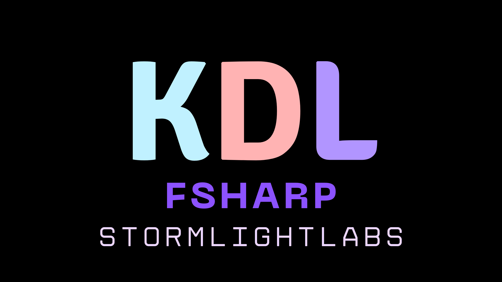
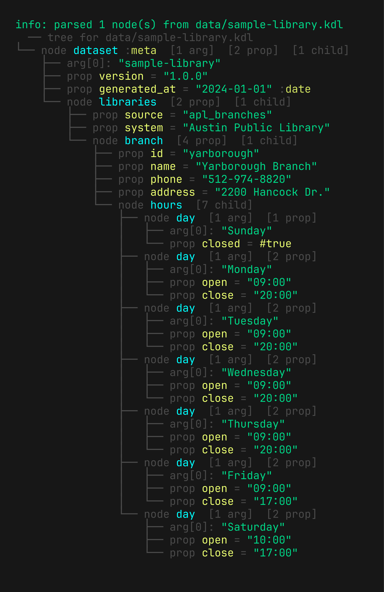

<!-- markdownlint-disable MD033 -->
# KDL F\#



KDL F# is a from-scratch, implementation of the [KDL 2.0](https://kdl.dev) document language written in pure F#.

It ships:

- `KDLFSharp.Core` - reusable lexer/parser/AST utilities with strong typing for strings,
  numbers, booleans, nulls, type annotations, and child blocks.
- `KDLFSharp.CLI` - a colored cli app that tokenizes + parses `.kdl` files, then prints
  the AST as a tree (with node/prop counts, typed values, and severity-styled diagnostics on errors).

## CLI

The CLI exposes the lexer and parser from the library, rendering KDL documents as colored AST trees with node/property counts, typed values, and severity-styled diagnostics for errors.

### Quick Start

View a KDL document as an AST tree

```sh
dotnet run --project KDLFSharp.CLI/KDLFSharp.CLI.fsproj data/zellij.kdl
```

<details>
<summary>
Example Output
</summary>



</details>

### Commands

<details>
<summary>
Parse KDL files and display the AST structure:
</summary>

```sh
# Parse from file
dotnet run --project KDLFSharp.CLI/KDLFSharp.CLI.fsproj data/sample-park.kdl

# Parse from stdin
cat data/sample-park.kdl | dotnet run --project KDLFSharp.CLI/KDLFSharp.CLI.fsproj -- -
```

</details>

<details>
<summary>
Convert KDL documents to JSON
</summary>

```sh
# Structured output (default) - AST with explicit types
dotnet run --project KDLFSharp.CLI/KDLFSharp.CLI.fsproj -- kdl-to-json data/sample-park.kdl

# Save to file
dotnet run --project KDLFSharp.CLI/KDLFSharp.CLI.fsproj -- kdl-to-json data/sample-park.kdl --out output.json

# Debug mode - canonical IR for lossless round-trips
dotnet run --project KDLFSharp.CLI/KDLFSharp.CLI.fsproj -- kdl-to-json data/sample-park.kdl --debug

# Sample mode - human-friendly format (lossy)
dotnet run --project KDLFSharp.CLI/KDLFSharp.CLI.fsproj -- kdl-to-json data/sample-park.kdl --sample --lossy
```

</details>

<details>
<summary>
Convert JSON back to KDL
</summary>

```sh
# From structured JSON
dotnet run --project KDLFSharp.CLI/KDLFSharp.CLI.fsproj -- json-to-kdl data/sample-park.json

# From debug IR
dotnet run --project KDLFSharp.CLI/KDLFSharp.CLI.fsproj -- json-to-kdl data/sample-park.ir.json --debug

# From sample format
dotnet run --project KDLFSharp.CLI/KDLFSharp.CLI.fsproj -- json-to-kdl data/sample-park.sample.json --sample

# With colored output
dotnet run --project KDLFSharp.CLI/KDLFSharp.CLI.fsproj -- json-to-kdl data/sample-park.json --pretty
```

</details>

<details>
<summary>
Convert KDL documents to XML
</summary>

```sh
# Structured output (default)
dotnet run --project KDLFSharp.CLI/KDLFSharp.CLI.fsproj -- kdl-to-xml data/sample-library.kdl

# Debug mode
dotnet run --project KDLFSharp.CLI/KDLFSharp.CLI.fsproj -- kdl-to-xml data/sample-library.kdl --debug

# Sample mode with custom namespace
dotnet run --project KDLFSharp.CLI/KDLFSharp.CLI.fsproj -- kdl-to-xml data/sample-library.kdl --sample --lossy --sample-ns https://example.com/kdl-meta
```

</details>

<details>
<summary>
Convert XML back to KDL
</summary>

```sh
# From structured XML
dotnet run --project KDLFSharp.CLI/KDLFSharp.CLI.fsproj -- xml-to-kdl data/sample-library.xml

# From debug IR
dotnet run --project KDLFSharp.CLI/KDLFSharp.CLI.fsproj -- xml-to-kdl data/sample-library.ir.xml --debug

# From sample format
dotnet run --project KDLFSharp.CLI/KDLFSharp.CLI.fsproj -- xml-to-kdl data/sample-library.sample.xml --sample
```

</details>

<details>
<summary>
Conversion Output Modes
</summary>

### Structured (`default`)

AST representation with explicit node types, value kinds, and type annotations.
Suitable for programmatic access and preserves the full KDL structure.

### Debug (`--debug`)

Canonical intermediate representation (IR) defined in `KDLFSharp.Core.JSON` and `KDLFSharp.Core.XML`.
Enables lossless round-trip conversions with complete fidelity.

### Sample (`--sample` `--lossy`)

Human-friendly format where properties and children are surfaced as plain fields with metadata in `_meta` blocks.
Lossy by design and optimized for readability over round-trip accuracy. Requires explicit `--lossy` acknowledgement.

</details>

### Options

```sh
# See help for an exhaustive list of options
dotnet run --project KDLFSharp.CLI/KDLFSharp.CLI.fsproj -- help
```

## Local Development

Prereqs: `.NET 9` SDK

```sh
# Format/build everything
dotnet build

# Run Tests
dotnet run --project KDLFSharp.Tests/KDLFSharp.Tests.fsproj

# View AST
dotnet run --project KDLFSharp.CLI/KDLFSharp.CLI.fsproj data/sample-park.kdl
dotnet run --project KDLFSharp.CLI/KDLFSharp.CLI.fsproj data/zellij.kdl
```

## Programmatic Usage

### Record Serialization and Deserialization

The `KDLFSharp.Core.Serialize` and `KDLFSharp.Core.Deserialize` modules provide automatic conversion between F# records and KDL documents using reflection.

#### Basic Usage

```fsharp
open KDLFSharp.Core
open KDLFSharp.Core.Serialize
open KDLFSharp.Core.Deserialize

// Define a record type
type Person = {
    Name: string
    Age: int
    Height: float
    IsActive: bool
}

// Create an instance
let person = {
    Name = "Alice"
    Age = 30
    Height = 5.6
    IsActive = true
}

// Serialize to KDL string
match Serialize.toString SerializeConfig.Default person with
| Ok kdl -> printfn "%s" kdl
| Error e -> printfn "Error: %O" e

// Deserialize from KDL string
let kdlText = """
Person {
    Name="Bob"
    Age=25
    Height=6.1
    IsActive=false
}
"""

match Deserialize.fromString<Person> SerializeConfig.Default kdlText with
| Ok person -> printfn "Loaded: %s, age %d" person.Name person.Age
| Error e -> printfn "Error: %O" e
```

#### Supported Types

The serializer supports:

- Primitives: `string`, `bool`, `int`, `int64`, `float`, `float32`, `decimal`, `byte`, `int16`, `uint16`, `uint32`, `uint64`
- Special values: `infinity`, `negative infinity`, `NaN`
- Optional fields: `option<'T>` (None values are omitted)
- Lists and arrays: `'T list`, `'T array`
- Nested records: Serialized as child nodes
- Null values: Represented as `#null`

#### Examples

<details>
<summary>
Optional Fields
</summary>

```fsharp
type Contact = {
    Name: string
    Email: string option
    Phone: string option
}

let contact = {
    Name = "Charlie"
    Email = Some "charlie@example.com"
    Phone = None  // Will be omitted from KDL
}
```

</details>

<details>
<summary>
Nested Records
</summary>

```fsharp
type Address = {
    Street: string
    City: string
    ZipCode: string
}

type PersonWithAddress = {
    Name: string
    Age: int
    Address: Address  // Serialized as child node
}

let person = {
    Name = "David"
    Age = 28
    Address = {
        Street = "123 Main St"
        City = "Austin"
        ZipCode = "78701"
    }
}
```

Results in KDL:

```kdl
PersonWithAddress {
    Name="David"
    Age=28
    Address {
        Street="123 Main St"
        City="Austin"
        ZipCode="78701"
    }
}
```

</details>

<details>
<summary>
Lists and Arrays
</summary>

```fsharp
type Team = {
    Name: string
    Members: string list
    Scores: int array
}

let team = {
    Name = "Engineering"
    Members = ["Alice"; "Bob"; "Charlie"]
    Scores = [| 95; 87; 92 |]
}
```

Lists of primitives become arguments, while lists of records become child nodes:

```fsharp
type Company = {
    Name: string
    Employees: Person list
}
```

</details>

#### Configuration

<details>
<summary>
Customize serialization behavior with `SerializeConfig`
</summary>

```fsharp
let config = {
    NestedRecordsAsChildren = true      // Nest records as child nodes
    ListItemsAsChildren = false         // Lists as arguments (default)
    IncludeTypeAnnotations = true       // Add type info for round-trips
    RootNodeName = Some "custom-name"   // Override node name
}

toString config myRecord
```

</details>

#### Error Handling

<details>
<summary>
All serialization operations return `Result<'T, SerializeError>`
</summary>

```fsharp
type SerializeError =
    | UnsupportedType of string
    | MissingRequiredField of string
    | TypeMismatch of expected: string * actual: string
    | InvalidValue of string
    | DeserializationFailed of string
```

</details>

#### API Reference

**Serialization (Serialize module):**

- `toNode: SerializeConfig -> obj -> SerializeResult<Node>` - Serialize record to Node
- `toDocument: SerializeConfig -> obj -> SerializeResult<Document>` - Serialize to Document
- `toString: SerializeConfig -> obj -> SerializeResult<string>` - Serialize to KDL string

**Deserialization (Deserialize module):**

- `fromNode<'T>: SerializeConfig -> Node -> SerializeResult<'T>` - Deserialize Node to record
- `fromDocument<'T>: SerializeConfig -> Document -> SerializeResult<'T>` - Deserialize from Document
- `fromString<'T>: SerializeConfig -> string -> SerializeResult<'T>` - Deserialize from KDL string

## TODO

- [x] JSON <-> KDL
- [x] XML <-> KDL
- [x] Record serialization to Map records to KDL and back
- [ ] Parse and manipulate KDL documents programmatically (Document Model)
- [ ] Query Language
- [ ] Schema Validation
